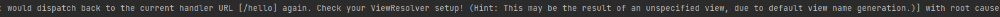

# 뷰리졸버

2023-01-04 23:17:16.732 ERROR 11764 --- \[nio-8000-exec-3] o.a.c.c.C.\[.\[.\[/].\[dispatcherServlet] : Servlet.service() for servlet \[dispatcherServlet] in context with path \[] threw exception \[Circular view path \[hello]: would dispatch back to the current handler URL \[/hello] again. Check your ViewResolver setup! (Hint: This may be the result of an unspecified view, due to default view name generation.)] with root cause

javax.servlet.ServletException: Circular view path \[hello]: would dispatch back to the current handler URL \[/hello] again. Check your ViewResolver setup! (Hint: This may be the result of an unspecified view, due to default view name generation.) at org.springframework.web.servlet.view.InternalResourceView.prepareForRendering(InternalResourceView.java:210) \~\[spring-webmvc-5.3.24.jar:5.3.24] at org.springframework.web.servlet.view.InternalResourceView.renderMergedOutputModel(InternalResourceView.java:148) \~\[spring-webmvc-5.3.24.jar:5.3.24] at org.springframework.web.servlet.view.AbstractView.render(AbstractView.java:316) \~\[spring-webmvc-5.3.24.jar:5.3.24] at org.springframework.web.servlet.DispatcherServlet.render(DispatcherServlet.java:1405) \~\[spring-webmvc-5.3.24.jar:5.3.24] at org.springframework.web.servlet.DispatcherServlet.processDispatchResult(DispatcherServlet.java:1149) \~\[spring-webmvc-5.3.24.jar:5.3.24] at org.springframework.web.servlet.DispatcherServlet.doDispatch(DispatcherServlet.java:1088) \~\[spring-webmvc-5.3.24.jar:5.3.24] at org.springframework.web.servlet.DispatcherServlet.doService(DispatcherServlet.java:964) \~\[spring-webmvc-5.3.24.jar:5.3.24] at org.springframework.web.servlet.FrameworkServlet.processRequest(FrameworkServlet.java:1006) \~\[spring-webmvc-5.3.24.jar:5.3.24] at org.springframework.web.servlet.FrameworkServlet.doGet(FrameworkServlet.java:898) \~\[spring-webmvc-5.3.24.jar:5.3.24] at javax.servlet.http.HttpServlet.service(HttpServlet.java:670) \~\[tomcat-embed-core-9.0.70.jar:4.0.FR] at org.springframework.web.servlet.FrameworkServlet.service(FrameworkServlet.java:883) \~\[spring-webmvc-5.3.24.jar:5.3.24] at javax.servlet.http.HttpServlet.service(HttpServlet.java:779) \~\[tomcat-embed-core-9.0.70.jar:4.0.FR] at org.apache.catalina.core.ApplicationFilterChain.internalDoFilter(ApplicationFilterChain.java:227) \~\[tomcat-embed-core-9.0.70.jar:9.0.70] at org.apache.catalina.core.ApplicationFilterChain.doFilter(ApplicationFilterChain.java:162) \~\[tomcat-embed-core-9.0.70.jar:9.0.70] at org.apache.tomcat.websocket.server.WsFilter.doFilter(WsFilter.java:53) \~\[tomcat-embed-websocket-9.0.70.jar:9.0.70] at org.apache.catalina.core.ApplicationFilterChain.internalDoFilter(ApplicationFilterChain.java:189) \~\[tomcat-embed-core-9.0.70.jar:9.0.70] at org.apache.catalina.core.ApplicationFilterChain.doFilter(ApplicationFilterChain.java:162) \~\[tomcat-embed-core-9.0.70.jar:9.0.70] at org.springframework.web.filter.RequestContextFilter.doFilterInternal(RequestContextFilter.java:100) \~\[spring-web-5.3.24.jar:5.3.24] at org.springframework.web.filter.OncePerRequestFilter.doFilter(OncePerRequestFilter.java:117) \~\[spring-web-5.3.24.jar:5.3.24] at org.apache.catalina.core.ApplicationFilterChain.internalDoFilter(ApplicationFilterChain.java:189) \~\[tomcat-embed-core-9.0.70.jar:9.0.70] at org.apache.catalina.core.ApplicationFilterChain.doFilter(ApplicationFilterChain.java:162) \~\[tomcat-embed-core-9.0.70.jar:9.0.70] at org.springframework.web.filter.FormContentFilter.doFilterInternal(FormContentFilter.java:93) \~\[spring-web-5.3.24.jar:5.3.24] at org.springframework.web.filter.OncePerRequestFilter.doFilter(OncePerRequestFilter.java:117) \~\[spring-web-5.3.24.jar:5.3.24] at org.apache.catalina.core.ApplicationFilterChain.internalDoFilter(ApplicationFilterChain.java:189) \~\[tomcat-embed-core-9.0.70.jar:9.0.70] at org.apache.catalina.core.ApplicationFilterChain.doFilter(ApplicationFilterChain.java:162) \~\[tomcat-embed-core-9.0.70.jar:9.0.70] at org.springframework.web.filter.CharacterEncodingFilter.doFilterInternal(CharacterEncodingFilter.java:201) \~\[spring-web-5.3.24.jar:5.3.24] at org.springframework.web.filter.OncePerRequestFilter.doFilter(OncePerRequestFilter.java:117) \~\[spring-web-5.3.24.jar:5.3.24] at org.apache.catalina.core.ApplicationFilterChain.internalDoFilter(ApplicationFilterChain.java:189) \~\[tomcat-embed-core-9.0.70.jar:9.0.70] at org.apache.catalina.core.ApplicationFilterChain.doFilter(ApplicationFilterChain.java:162) \~\[tomcat-embed-core-9.0.70.jar:9.0.70] at org.apache.catalina.core.StandardWrapperValve.invoke(StandardWrapperValve.java:177) \~\[tomcat-embed-core-9.0.70.jar:9.0.70] at org.apache.catalina.core.StandardContextValve.invoke(StandardContextValve.java:97) \~\[tomcat-embed-core-9.0.70.jar:9.0.70] at org.apache.catalina.authenticator.AuthenticatorBase.invoke(AuthenticatorBase.java:541) \~\[tomcat-embed-core-9.0.70.jar:9.0.70] at org.apache.catalina.core.StandardHostValve.invoke(StandardHostValve.java:135) \~\[tomcat-embed-core-9.0.70.jar:9.0.70] at org.apache.catalina.valves.ErrorReportValve.invoke(ErrorReportValve.java:92) \~\[tomcat-embed-core-9.0.70.jar:9.0.70] at org.apache.catalina.core.StandardEngineValve.invoke(StandardEngineValve.java:78) \~\[tomcat-embed-core-9.0.70.jar:9.0.70] at org.apache.catalina.connector.CoyoteAdapter.service(CoyoteAdapter.java:360) \~\[tomcat-embed-core-9.0.70.jar:9.0.70] at org.apache.coyote.http11.Http11Processor.service(Http11Processor.java:399) \~\[tomcat-embed-core-9.0.70.jar:9.0.70] at org.apache.coyote.AbstractProcessorLight.process(AbstractProcessorLight.java:65) \~\[tomcat-embed-core-9.0.70.jar:9.0.70] at org.apache.coyote.AbstractProtocol$ConnectionHandler.process(AbstractProtocol.java:891) \~\[tomcat-embed-core-9.0.70.jar:9.0.70] at org.apache.tomcat.util.net.NioEndpoint$SocketProcessor.doRun(NioEndpoint.java:1784) \~\[tomcat-embed-core-9.0.70.jar:9.0.70] at org.apache.tomcat.util.net.SocketProcessorBase.run(SocketProcessorBase.java:49) \~\[tomcat-embed-core-9.0.70.jar:9.0.70] at org.apache.tomcat.util.threads.ThreadPoolExecutor.runWorker(ThreadPoolExecutor.java:1191) \~\[tomcat-embed-core-9.0.70.jar:9.0.70] at org.apache.tomcat.util.threads.ThreadPoolExecutor$Worker.run(ThreadPoolExecutor.java:659) \~\[tomcat-embed-core-9.0.70.jar:9.0.70] at org.apache.tomcat.util.threads.TaskThread$WrappingRunnable.run(TaskThread.java:61) \~\[tomcat-embed-core-9.0.70.jar:9.0.70] at java.base/java.lang.Thread.run(Thread.java:833) \~\[na:na]




*   해결방법 : 의존성 주입 시에 \


    ```
    implementation("org.springframework.boot:spring-boot-starter-thymeleaf")
    ```

    을

    ```
    implementation("org.springframework.boot:spring-boot-thymeleaf")
    ```

    로 입력해셔 생겼던 문제
